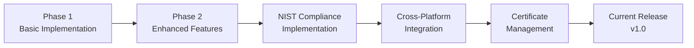

# 🗂️ NullByters - Secure Data Wiping & Certificate Management Suite

[](LICENSE)
[](https://github.com/antiquark007/NullByters)
[](https://csrc.nist.gov/publications/detail/sp/800-88/rev-1/final)

> A comprehensive, cross-platform secure data wiping solution that provides NIST SP 800-88 compliant data sanitization with automated certificate generation and verification.

---

## 📋 Table of Contents

- [Overview](#overview)
- [Project Structure](#project-structure)
- [Core Features](#core-features)
- [Getting Started](#getting-started)
- [Development Iterations](#development-iterations)
- [Contributing](#contributing)
- [License](#license)

---

## 🎯 Overview

NullByters is designed to provide enterprise-grade data sanitization with comprehensive audit trails and compliance reporting. The suite includes multiple implementations and testing approaches developed through iterative refinement, ensuring data security compliance across various platforms and enterprise use cases.

**Key Benefits:**
- ✅ NIST SP 800-88 Rev. 1 compliance
- ✅ Cross-platform compatibility
- ✅ Automated certificate generation
- ✅ Cryptographic verification
- ✅ Multiple user interfaces

---

## 📁 Project Structure

```
NullByters/
├── 📄 README.md                           # Project documentation
├── 📱 android/                            # Android device wiping tools
│   ├── 🐍 pywipe.py                      # Python-based Android wiper
│   └── 📜 wipe_android.sh                # Shell script for Android wiping
├── 📚 Article/                            # Documentation and standards
│   └── 📋 NIST SP 800‑88                 # NIST guidelines reference
├── 💿 bootable_usb/                       # USB boot environment tools
│   ├── 🔐 certgen.py                     # Certificate generation for USB
│   ├── 🔧 driver.py                      # Hardware driver management
│   ├── 📖 README.md                      # USB boot setup guide
│   └── 💻 cli/                           # Command-line interface tools
├── 🏆 CertificateTOOL/                    # Certificate management system
│   ├── ⚙️ config.py                      # Configuration settings
│   ├── 🚀 main.py                        # Main certificate tool entry
│   ├── 📦 payload_utils.py               # Certificate payload handling
│   ├── 📄 pdf_gen.py                     # PDF certificate generation
│   ├── 🔲 qr_utils.py                    # QR code generation/verification
│   ├── ✍️ sign.py                        # Digital signature operations
│   ├── ☁️ uploader.py                    # Cloud upload functionality
│   ├── ✅ verifier.py                    # Certificate verification
│   └── 📝 requirements.txt               # Python dependencies
├── 🖥️ CrossPlatformDeskApp/               # Go-based desktop application
│   ├── 📦 go.mod                         # Go module definition
│   ├── 🔒 go.sum                         # Go dependencies
│   ├── 🚪 cmd/                           # Command-line entry points
│   └── 🎨 internal/pages/                # UI page implementations
├── 💻 DekstopApp/                         # Main Electron desktop application
│   ├── 📝 commands.txt                   # Development commands reference
│   ├── 📖 README.md                      # Desktop app documentation
│   ├── 🐍 cert_env/                      # Python virtual environment
│   ├── 🛠️ Cert_Tool/                     # Integrated certificate tools
│   ├── 🎨 gui/                           # Electron GUI implementation
│   │   ├── ⚡ index.js                   # Main Electron process
│   │   ├── 📦 package.json               # Node.js dependencies
│   │   ├── 📄 pages/                     # HTML page templates
│   │   └── 🎭 renderer/                  # Frontend JavaScript
│   └── 🔧 wipe-tool/                     # Core wiping functionality
└── 🧪 test/                               # Development iterations and testing
    ├── ⚙️ onewipe_core                   # Core C implementation
    ├── 🔧 onewipe_core.c                 # Main C wiping engine
    ├── 💿 testdisk.img                   # Test disk image
    ├── 🖥️ DekstopApp/                    # Test desktop app versions
    ├── 📋 NIST/my-c-project/             # NIST-compliant C implementation
    ├── 🚀 phase1/nullbytes_phase1.c      # Initial development phase
    └── ⭐ phase2/nullbytes_phase2.c      # Enhanced implementation
```

---

## 🚀 Core Features

### 🛡️ Secure Data Wiping

| Feature | Description |
|---------|-------------|
| **NIST SP 800-88 Compliance** | Complete implementation of Clear, Purge, and Destroy methods |
| **Multiple Algorithms** | Zero fill, random fill, and cryptographic erase options |
| **Cross-Platform Support** | Native support for Windows, Linux, and macOS |
| **Device Detection** | Automatic enumeration and identification of storage devices |
| **Safety Checks** | Built-in system drive protection and pre-wipe validation |

### 📜 Certificate Management

| Feature | Description |
|---------|-------------|
| **Automated Generation** | PDF and JSON certificate formats with customizable templates |
| **Digital Signatures** | Cryptographic verification using industry-standard algorithms |
| **QR Code Integration** | Mobile-friendly verification with embedded metadata |
| **Compliance Tracking** | Complete audit trail for regulatory compliance |
| **Cloud Upload** | Secure certificate storage with encrypted transmission |

### 🖥️ User Interfaces

<table>
<tr>
<td align="center">

<br><strong>Desktop GUI</strong>
<br>Cross-platform graphical interface
</td>
<td align="center">

<br><strong>Web Interface</strong>
<br>Browser-based management
</td>
<td align="center">

<br><strong>Command Line</strong>
<br>Scriptable automation
</td>
<td align="center">

<br><strong>Go Desktop</strong>
<br>High-performance native option
</td>
</tr>
</table>

---

## 🚀 Getting Started

### Prerequisites

- **Python 3.8+** for certificate tools
- **Node.js 16+** for Electron GUI
- **Go 1.19+** for native desktop app
- **C Compiler** for core wiping engine

### Quick Start

1. **Clone the repository:**
   ```bash
   git clone https://github.com/antiquark007/NullByters.git
   cd NullByters
   ```

2. **Install Python dependencies:**
   ```bash
   cd CertificateTOOL
   pip install -r requirements.txt
   ```

3. **Set up Electron GUI:**
   ```bash
   cd DekstopApp/gui
   npm install
   npm start
   ```

4. **Build Go desktop app:**
   ```bash
   cd CrossPlatformDeskApp
   go mod tidy
   go build -o nullbyters ./cmd
   ```

### Usage Examples

#### Command Line Wiping
```bash
# Wipe a specific device with NIST Clear method
./nullbyters wipe --device /dev/sdb --method clear --certificate

# Generate verification certificate only
./nullbyters cert --device /dev/sdb --verify
```

#### Python API
```python
from CertificateTOOL import main

# Generate certificate with QR code
certificate = main.generate_certificate(
    device_id="USB_DEVICE_001",
    method="purge",
    include_qr=True
)
```

---

## 🧪 Development Iterations

The project has evolved through multiple phases, each stored in the `test/` directory:

### Phase Timeline



| Phase | Focus | Key Achievements |
|-------|-------|------------------|
| **Phase 1** | Core functionality | Basic wiping algorithms, initial C implementation |
| **Phase 2** | Enhanced security | Multi-pass wiping, improved validation |
| **NIST Project** | Compliance | Full NIST SP 800-88 Rev. 1 implementation |
| **Desktop Apps** | User Experience | Multiple GUI implementations and testing |
| **Current** | Production Ready | Integrated suite with certificate management |

---

## 🤝 Contributing

We welcome contributions from the community! Please read our [Contributing Guidelines](CONTRIBUTING.md) for detailed information on how to contribute to NullByters.

### Development Setup

1. Fork the repository on GitHub
2. Create a feature branch: `git checkout -b feature/your-feature-name`
3. Make your changes and commit: `git commit -m 'Add your feature description'`
4. Push to your branch: `git push origin feature/your-feature-name`
5. Submit a Pull Request with a clear description of your changes

### Code Standards & Guidelines

- **Python**: Follow PEP 8 style guide and include type hints where applicable
- **JavaScript/TypeScript**: Use ESLint configuration and Prettier for formatting
- **Go**: Format code with `gofmt` and follow Go best practices
- **C/C++**: Follow GNU coding standards for consistency
- **Documentation**: Document all public APIs and include inline comments
- **Testing**: Add comprehensive tests for new features and bug fixes
- **Security**: Follow secure coding practices, especially for cryptographic operations

---

## 📄 License

This project is licensed under the MIT License - see the [LICENSE](LICENSE) file for details.

---

## 🙏 Acknowledgments

- **[NIST SP 800-88 Rev. 1](https://csrc.nist.gov/publications/detail/sp/800-88/rev-1/final)** - Guidelines for Media Sanitization
- **Open Source Community** - For invaluable tools, libraries, and feedback
- **Security Research Community** - For validation and security auditing of our implementation
- **Enterprise Partners** - For real-world testing and compliance validation
- **Contributors** - Special thanks to all developers who have contributed to this project

---

## 📞 Support & Contact

- **Issues & Bug Reports**: [GitHub Issues](https://github.com/antiquark007/NullByters/issues)
- **Feature Requests**: [GitHub Discussions](https://github.com/antiquark007/NullByters/discussions)
- **Security Issues**: Please report security vulnerabilities privately via email

---

<div align="center">

**Made with ❤️ by the NullByters Development Team**

[](https://github.com/antiquark007/NullByters/stargazers)
[](https://github.com/antiquark007/NullByters/network/members)
[](https://github.com/antiquark007/NullByters/issues)

[🌟 Star this repo](https://github.com/antiquark007/NullByters/stargazers) | [🐛 Report Bug](https://github.com/antiquark007/NullByters/issues/new?template=bug_report.md) | [💡 Request Feature](https://github.com/antiquark007/NullByters/issues/new?template=feature_request.md) | [📖 Documentation](https://github.com/antiquark007/NullByters/wiki)

</div>
